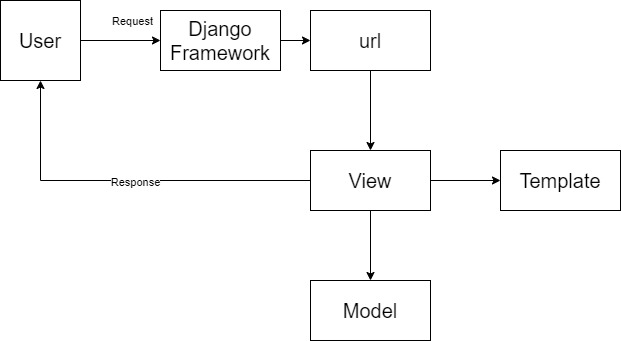

# my_book_collection

author: Muh. Syarief Mulyadi

## Short Intro:

Repo ini berisi tugas untuk mata kuliah Pemrograman Berbasis Platform 2023/2024

## Tugas 1

**A. Jelaskan bagaimana cara kamu mengimplementasikan checklist di atas secara step-by-step (bukan hanya sekadar mengikuti tutorial).**

1. Membuat proyek Django baru.

    Untuk membuat projek django baru kita tinggal mengikuti langkah-langkah di tutorial 0 untuk membuat projek Django baru. Untuk projek ini saya akan membuatnya di direktori bernama my_book_collection
    Membuat aplikasi dengan nama main pada proyek tersebut

    Saya akan membuat aplikasi main dengan menjalankan perintah:

    
        python manage.py startapp main

    setelah itu saya akan menambahkan secara manual aplikasi main di file settings.py

2. Melakukan routing pada proyek agar dapat menjalankan aplikasi main.

    kita akan menambahkan routing url di dalam direktori projek utama kita yaitu my_book_collection. Berikut tampilannya setelah ditambahkan:
        
        '''
        from django.contrib import admin
        from django.urls import path, include

        urlpatterns = [
            path('admin/', admin.site.urls),
            path('main/', include('main.urls')),
        ]
        '''

3. Membuat model pada aplikasi main dengan nama Item dan atribut wajibnya.

    Untuk membuat model kita tinggal masuk ke dirktori main kita dan menambahkan class Buku yang merupakan item yang saya pilih. Selanjutnya saya kan menambahkan beberapa atribut untuk model tersebut.
        
        '''
        class Product(models.Model):
            name = models.CharField(max_length=255)
            amount = models.IntegerField()
            description = models.TextField()
        
        '''

4. Membuat sebuah fungsi pada views.py yang mengembalikan HTML yang berisi nama aplikasi dan nama kelas.

    Di dalam views.py saya akan membuat fungsi bernama show_main yang mana akan menampilkan HTML yang dipass bersama dengan variabel context yaitu nama dan kelas saya.

    Membuat sebuah routing pada urls.py aplikasi main untuk memetakan fungsi yang telah dibuat pada views.py. Untuk melakukan routing aplikasi main kita, kita akan pertama-tama menambahkan berkas urls.py di dalam direktori main dan mengisinya dengan kode berikut:

        '''
        from django.urls import path
        from main.views import show_main

        app_name = 'main'

        urlpatterns = [
            path('', show_main, name='show_main'),
        ]
        '''

5. Melanjutkan deployment ke adaptable.

    Untuk melakukan deployment kita tinggal mengikuti langkah-langkah di tutorial 0 namun mengubahnya Start command Sebagai berikut:

        '''
        python manage.py migrate && gunicorn my_book_collection.wsgi
    '''

**B. Buatlah bagan yang berisi request client ke web aplikasi berbasis Django beserta responnya dan jelaskan pada bagan tersebut kaitan antara urls.py, views.py, models.py, dan berkas html.**

urls.py di direktori projek akan menghandle urls yang valid pada projek tersebut. 

views.py akan mendefinisikan fungsi menampilkan halaman html sebagai sebuah response. Dan mempass context ke template html kita

models.py berhubungan dengan data base kita. 

**C. Jelaskan mengapa kita menggunakan virtual environment? Apakah kita tetap dapat membuat aplikasi web berbasis Django tanpa menggunakan virtual environment?**
    
Kita menggunakan virtual environment untuk karena beberapa alasan berikut:

1. Isolasi Proyek: Virtual environment memungkinkan kita membuat lingkungan isolasi yang independen untuk setiap proyek.Ini berarti setiap proyek dapat memiliki dependensi Python (misalnya, paket atau library) yang berbeda tanpa interferensi dengan proyek lain. Ini menghindari masalah konflik versi dan memastikan proyek-proyek kita tetap bersih dan terpisah.

2. Manajemen Dependensi: Dengan venv, Anda dapat dengan mudah mengelola dan menginstal dependensi yang dibutuhkan untuk proyek kita. Kita dapat membuat file requirements.txt yang berisi daftar semua paket yang dibutuhkan, yang memungkinkan kita atau anggota tim lain untuk menginstalnya dengan mudah di lingkungan virtual yang sama.

    
**D. Jelaskan apakah itu MVC, MVT, MVVM dan perbedaan dari ketiganya.**

**MVC (Model-View-Controller):**

_Model_

Deskripsi: Model adalah komponen yang bertanggung jawab untuk mengelola data dan logika bisnis dalam aplikasi. Ini mencakup struktur data, operasi pada data, validasi, dan perubahan data.

Tugas: Model menghadirkan data kepada Controller, dan jika data berubah, Model memberi tahu Controller.

_View_

Deskripsi: View adalah antarmuka pengguna yang digunakan oleh pengguna untuk berinteraksi dengan aplikasi. Ini mencakup semua elemen tampilan seperti tombol, formulir, teks, dan tampilan lainnya.

Tugas: View menampilkan informasi dari Model kepada pengguna dan mengirim masukan pengguna ke Controller saat interaksi terjadi.
    
_Controller_

Deskripsi: Controller bertanggung jawab untuk mengontrol alur aplikasi. Ini menerima masukan dari pengguna melalui View, memprosesnya, dan mengkoordinasikan tindakan yang sesuai dengan Model.

Tugas: Controller mengambil tindakan berdasarkan masukan pengguna, memperbarui Model jika diperlukan, dan mengatur tampilan yang akan ditampilkan oleh View.
    
_Perbedaan utama MVC_:

MVC adalah pola desain arsitektur perangkat lunak yang memisahkan tanggung jawab antara Model, View, dan Controller. Memungkinkan pengembangan dan pemeliharaan aplikasi yang lebih mudah dan terstruktur dengan memisahkan logika bisnis, tampilan, dan kontrol.
    
**MVT (Model-View-Template):**

_Model_

Deskripsi: Mirip dengan Model dalam MVC, Model dalam MVT adalah komponen yang mengelola data dan logika bisnis aplikasi.

Tugas: Model mengelola data dan operasi pada data, serta menyediakan data untuk Template.
    
_View_

Deskripsi: View dalam MVT mirip dengan View dalam MVC. Ini adalah komponen yang bertanggung jawab untuk menampilkan data kepada pengguna.

Tugas: View menampilkan data yang diberikan oleh Model dan berinteraksi dengan Template.
    
_Template_

Deskripsi: Template adalah komponen yang unik untuk MVT. Ini adalah bagian dari sistem templating yang mengatur tampilan halaman web. Template berisi kode HTML dengan placeholder untuk data yang akan ditampilkan.

Tugas: Template mengambil data dari View dan menghasilkan halaman HTML yang akan ditampilkan kepada pengguna.
    
_Perbedaan utama MVT_

MVT adalah konsep yang digunakan dalam kerangka kerja Django, yang sering digunakan untuk pengembangan web. MVT menggabungkan Model, View, dan Template untuk menghasilkan halaman web dinamis.
    
**MVVM (Model-View-ViewModel):**

_Model_

Deskripsi: Seperti dalam MVC dan MVT, Model adalah komponen yang mengelola data dan logika bisnis aplikasi.

Tugas: Model mengelola data dan berkomunikasi dengan ViewModel saat data berubah.
    
_View_

Deskripsi: View adalah antarmuka pengguna yang digunakan oleh pengguna. Ini hanya menangani tampilan dan interaksi pengguna.
    
Tugas: View menampilkan data yang diberikan oleh ViewModel dan mengirim perubahan yang diberikan oleh pengguna ke ViewModel.
    
_ViewModel_

Deskripsi: ViewModel adalah perantara antara Model dan View. Ini mengelola presentasi data yang akan ditampilkan di View dan berfungsi untuk memisahkan logika tampilan dari Model.
    
Tugas: ViewModel mengambil data dari Model, memformatnya agar sesuai untuk ditampilkan di View, dan menerima masukan pengguna untuk kemudian diteruskan ke Model.
    
_Perbedaan utama MVVM_:

MVVM adalah pola desain arsitektur yang dirancang khusus untuk aplikasi berbasis antarmuka pengguna kompleks, seperti aplikasi mobile dan aplikasi desktop. Memungkinkan pengembang untuk memisahkan logika tampilan (View) dari Model, sehingga memudahkan pengujian dan pemeliharaan kode.