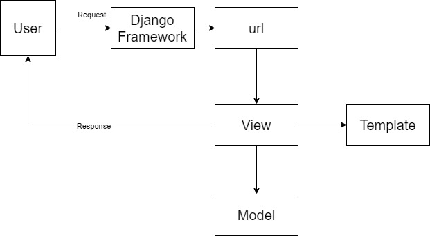
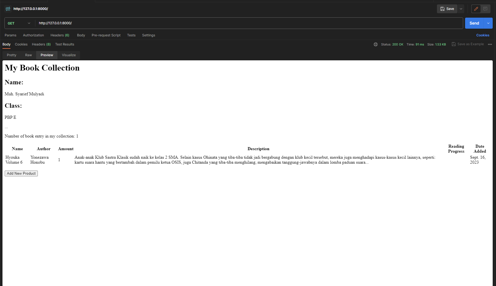
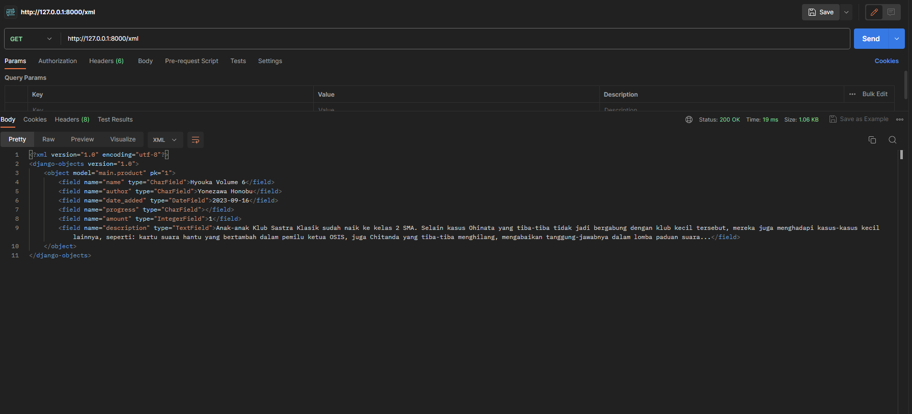
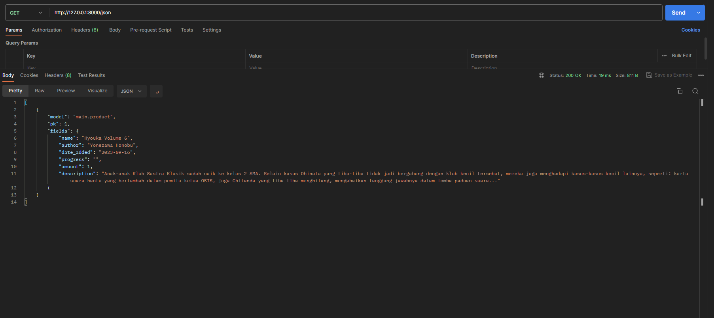
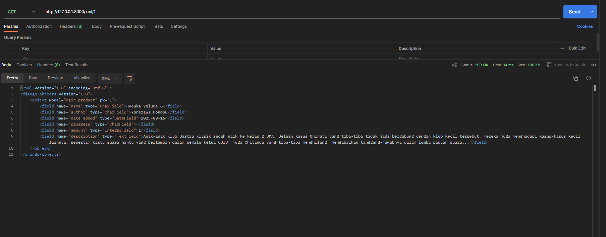
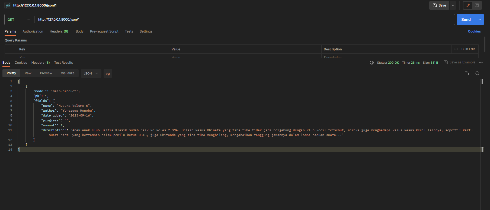

# my_book_collection

author: Muh. Syarief Mulyadi

Repo ini berisi tugas untuk mata kuliah Pemrograman Berbasis Platform 2023/2024

# Table Of Content:
1. [Tugas 2](#tugas-2)
2. [Tugas 3](#tugas-3)
3. [Tugas 4](#tugas-4)
4. [Tugas 5](#tugas-5)

## Tugas 2

**A. Jelaskan bagaimana cara kamu mengimplementasikan checklist di atas secara step-by-step (bukan hanya sekadar mengikuti tutorial).**

1. Membuat proyek Django baru.

    Untuk membuat projek django baru kita tinggal mengikuti langkah-langkah di tutorial 0 untuk membuat projek Django baru. Untuk projek ini saya akan membuatnya di direktori bernama my_book_collection
    Membuat aplikasi dengan nama main pada proyek tersebut

    Saya akan membuat aplikasi main dengan menjalankan perintah:

    
        python manage.py startapp main

    setelah itu saya akan menambahkan secara manual aplikasi main di file settings.py

2. Melakukan routing pada proyek agar dapat menjalankan aplikasi main.

    kita akan menambahkan routing url di dalam direktori projek utama kita yaitu my_book_collection. Berikut tampilannya setelah ditambahkan:
        
        '''
        from django.contrib import admin
        from django.urls import path, include

        urlpatterns = [
            path('admin/', admin.site.urls),
            path('main/', include('main.urls')),
        ]
        '''

3. Membuat model pada aplikasi main dengan nama Item dan atribut wajibnya.

    Untuk membuat model kita tinggal masuk ke dirktori main kita dan menambahkan class Buku yang merupakan item yang saya pilih. Selanjutnya saya kan menambahkan beberapa atribut untuk model tersebut.
        
        '''
        class Product(models.Model):
            name = models.CharField(max_length=255)
            amount = models.IntegerField()
            description = models.TextField()
        
        '''

4. Membuat sebuah fungsi pada views.py yang mengembalikan HTML yang berisi nama aplikasi dan nama kelas.

    Di dalam views.py saya akan membuat fungsi bernama show_main yang mana akan menampilkan HTML yang dipass bersama dengan variabel context yaitu nama dan kelas saya.

    Membuat sebuah routing pada urls.py aplikasi main untuk memetakan fungsi yang telah dibuat pada views.py. Untuk melakukan routing aplikasi main kita, kita akan pertama-tama menambahkan berkas urls.py di dalam direktori main dan mengisinya dengan kode berikut:

        '''
        from django.urls import path
        from main.views import show_main

        app_name = 'main'

        urlpatterns = [
            path('', show_main, name='show_main'),
        ]
        '''

5. Melanjutkan deployment ke adaptable.

    Untuk melakukan deployment kita tinggal mengikuti langkah-langkah di tutorial 0 namun mengubahnya Start command Sebagai berikut:

        '''
        python manage.py migrate && gunicorn my_book_collection.wsgi
    '''

**B. Buatlah bagan yang berisi request client ke web aplikasi berbasis Django beserta responnya dan jelaskan pada bagan tersebut kaitan antara urls.py, views.py, models.py, dan berkas html.**

urls.py di direktori projek akan menghandle urls yang valid pada projek tersebut. 

views.py akan mendefinisikan fungsi menampilkan halaman html sebagai sebuah response. Dan mempass context ke template html kita

models.py berhubungan dengan data base kita. 

**C. Jelaskan mengapa kita menggunakan virtual environment? Apakah kita tetap dapat membuat aplikasi web berbasis Django tanpa menggunakan virtual environment?**
    
Kita menggunakan virtual environment untuk karena beberapa alasan berikut:

1. Isolasi Proyek: Virtual environment memungkinkan kita membuat lingkungan isolasi yang independen untuk setiap proyek.Ini berarti setiap proyek dapat memiliki dependensi Python (misalnya, paket atau library) yang berbeda tanpa interferensi dengan proyek lain. Ini menghindari masalah konflik versi dan memastikan proyek-proyek kita tetap bersih dan terpisah.

2. Manajemen Dependensi: Dengan venv, Anda dapat dengan mudah mengelola dan menginstal dependensi yang dibutuhkan untuk proyek kita. Kita dapat membuat file requirements.txt yang berisi daftar semua paket yang dibutuhkan, yang memungkinkan kita atau anggota tim lain untuk menginstalnya dengan mudah di lingkungan virtual yang sama.

    
**D. Jelaskan apakah itu MVC, MVT, MVVM dan perbedaan dari ketiganya.**

**MVC (Model-View-Controller):**

_Model_

Deskripsi: Model adalah komponen yang bertanggung jawab untuk mengelola data dan logika bisnis dalam aplikasi. Ini mencakup struktur data, operasi pada data, validasi, dan perubahan data.

Tugas: Model menghadirkan data kepada Controller, dan jika data berubah, Model memberi tahu Controller.

_View_

Deskripsi: View adalah antarmuka pengguna yang digunakan oleh pengguna untuk berinteraksi dengan aplikasi. Ini mencakup semua elemen tampilan seperti tombol, formulir, teks, dan tampilan lainnya.

Tugas: View menampilkan informasi dari Model kepada pengguna dan mengirim masukan pengguna ke Controller saat interaksi terjadi.
    
_Controller_

Deskripsi: Controller bertanggung jawab untuk mengontrol alur aplikasi. Ini menerima masukan dari pengguna melalui View, memprosesnya, dan mengkoordinasikan tindakan yang sesuai dengan Model.

Tugas: Controller mengambil tindakan berdasarkan masukan pengguna, memperbarui Model jika diperlukan, dan mengatur tampilan yang akan ditampilkan oleh View.
    
_Perbedaan utama MVC_:

MVC adalah pola desain arsitektur perangkat lunak yang memisahkan tanggung jawab antara Model, View, dan Controller. Memungkinkan pengembangan dan pemeliharaan aplikasi yang lebih mudah dan terstruktur dengan memisahkan logika bisnis, tampilan, dan kontrol.
    
**MVT (Model-View-Template):**

_Model_

Deskripsi: Mirip dengan Model dalam MVC, Model dalam MVT adalah komponen yang mengelola data dan logika bisnis aplikasi.

Tugas: Model mengelola data dan operasi pada data, serta menyediakan data untuk Template.
    
_View_

Deskripsi: View dalam MVT mirip dengan View dalam MVC. Ini adalah komponen yang bertanggung jawab untuk menampilkan data kepada pengguna.

Tugas: View menampilkan data yang diberikan oleh Model dan berinteraksi dengan Template.
    
_Template_

Deskripsi: Template adalah komponen yang unik untuk MVT. Ini adalah bagian dari sistem templating yang mengatur tampilan halaman web. Template berisi kode HTML dengan placeholder untuk data yang akan ditampilkan.

Tugas: Template mengambil data dari View dan menghasilkan halaman HTML yang akan ditampilkan kepada pengguna.
    
_Perbedaan utama MVT_

MVT adalah konsep yang digunakan dalam kerangka kerja Django, yang sering digunakan untuk pengembangan web. MVT menggabungkan Model, View, dan Template untuk menghasilkan halaman web dinamis.
    
**MVVM (Model-View-ViewModel):**

_Model_

Deskripsi: Seperti dalam MVC dan MVT, Model adalah komponen yang mengelola data dan logika bisnis aplikasi.

Tugas: Model mengelola data dan berkomunikasi dengan ViewModel saat data berubah.
    
_View_

Deskripsi: View adalah antarmuka pengguna yang digunakan oleh pengguna. Ini hanya menangani tampilan dan interaksi pengguna.
    
Tugas: View menampilkan data yang diberikan oleh ViewModel dan mengirim perubahan yang diberikan oleh pengguna ke ViewModel.
    
_ViewModel_

Deskripsi: ViewModel adalah perantara antara Model dan View. Ini mengelola presentasi data yang akan ditampilkan di View dan berfungsi untuk memisahkan logika tampilan dari Model.
    
Tugas: ViewModel mengambil data dari Model, memformatnya agar sesuai untuk ditampilkan di View, dan menerima masukan pengguna untuk kemudian diteruskan ke Model.
    
_Perbedaan utama MVVM_:

MVVM adalah pola desain arsitektur yang dirancang khusus untuk aplikasi berbasis antarmuka pengguna kompleks, seperti aplikasi mobile dan aplikasi desktop. Memungkinkan pengembang untuk memisahkan logika tampilan (View) dari Model, sehingga memudahkan pengujian dan pemeliharaan kode.

## Tugas 3

### Apa perbedaan antara form POST dan form GET dalam Django?

Dalam Django form POST dan GET adalah dua method HTTP request yang disupport. Perbedaan utama antara POST dan GET terletak pada caranya menghandle form request. Untuk POST, Browser menggabungkan data form, mengkodekannya untuk transmisi, mengirimkannya ke server, dan kemudian menerima kembali responsnya. Sedangkan untuk GET, sebaliknya, menggabungkan data yang dikirimkan ke dalam string, dan menggunakannya untuk menulis URL. URL berisi alamat tempat data harus dikirim, serta key dan value data.

Akibat properti ini, POST cocok digunakan untuk form yang bersifat sensitif seperti form login, sedangkan GET lebih cocok untuk form yang tidak sensitif seperti _search bar_

### Apa perbedaan utama antara XML, JSON, dan HTML dalam konteks pengiriman data?

XML sering digunakan dalam situasi di mana data perlu memiliki struktur yang baik, dapat menjelaskan dirinya sendiri, dan mudah dibaca oleh manusia. Ini umumnya digunakan dalam berkas konfigurasi, format pertukaran data seperti RSS dan Atom, dan sebagai dasar untuk bahasa markup lainnya.

JSON banyak digunakan untuk pertukaran data dalam API web, berkas konfigurasi, dan sebagai format penyimpanan data. Ini disukai karena kesederhanaan dan kemudahannya dalam aplikasi JavaScript.

HTML digunakan untuk membuat halaman web dan mendefinisikan struktur, konten, dan presentasinya. Biasanya tidak digunakan untuk pertukaran data, meskipun dapat mengangkut data dalam form web.

### Mengapa JSON sering digunakan dalam pertukaran data antara aplikasi web modern?

JSON banyak digunakan dalam pertukaran data dalam aplikasi web modern karena hal-hal berikut:
1. Dibanding XML dan HTML, JSON memiliki format yang lebih ringan. Hal ini membuat beban data yang harus di transfer menjadi lebih kecil sehingga data dapat di transfer lebih cepat.
2. JSON yang merupakan kepanjangan dari Javascript Object Notation, memiliki format yang sama dengan Object model Javascript, hal ini membuat manipulasi data dari JSON cukup mudah. Dan ditambah dengan penggunaan Javascript di berbagai macam web app membuatnya mudah untuk di tangani.

### Langkah-langkah mengerjakan checkpoint

**1. Mengubah model sesuai dengan kebutuhan.**

Untuk tugas 3 saya akan menambahkan beberapa atribut baru untuk model saya. Atribut yang saya tambahkan adalah sebagai berikut:
    
1. author : Penulis atau pengarang dari buku
2. progress : Berapa persen bagian dari buku yang telah saya baca
3. description : Synopsis dari buku

jadi, sekarang model Product saya akan menjadi seperti berikut:

    '''

    class Product(models.Model):
        name = models.CharField(max_length=255, default="", blank=True)
        author = models.CharField(max_length=255, default="", blank=True)
        date_added = models.DateField(auto_now_add=True)
        progress = models.CharField(max_length=255, default="",blank=True)
        amount = models.IntegerField(default="", blank=True)
        description = models.TextField(default="", blank=True)
    
    '''

**2. Membuat input form untuk menambahkan objek model pada aplikasi**

Untuk membuat input form pertama-tama saya membuat file baru yang bernama direktori main bernama _forms.py_. File ini akan menghandle form untuk aplikasi kita. Selanjutnya saya akan membuat file html baru di folder templates di direktori main  yang bernama _create_product.html_. File ini akan berisi template halaman untuk menambahkan product.Selanjutnya saya menambahkan fungsi tambahan bernama create_product di file _views.py_ serta menambahkan urlpattern dari halaman untuk menambahkan product tersebut di file _urls.py_. Fungsi ini akan bertugas menampilkan halaman untuk menambahkan product ke database.

 berikut code dari fungsi create_product dan urlpattern halamannya:
    
    '''

        def create_product(request):
            form = ProductForm(request.POST or None)

            if form.is_valid() and request.method == "POST":
                form.save()
                return HttpResponseRedirect(reverse('main:show_main'))

            context = {'form': form}
            return render(request, "create_product.html", context)

    '''

        path('create-product', create_product, name='create_product'),

    '''

**3. Memodifikasi template lain untuk menampilkan product dan tombol untuk menambahkan product.**

Untuk menampilkan list product sebagai sebuah table saya akan membuat file html tambahan bernama  _book_table.html_ yang berisi bentuk komponen html dari table tersebut. Kemudian saya tinggal menambahkan komponen tersebut ke template html lain di mana table tersebut akan ditampilkan menggunakan keyword include. Selain itu, saya juga akan menambahkan tombol untuk menambahkan product ke halaman main. Tombol ini akan memiliki tautan yang terhubung dengan halaman create_product.

berikut kode dari file _book_table.html_:

'''

    
Number of book entry in my collection: {{products|length}}

    <table>
        <tr>
            <th>Name</th>
            <th>Author</th>
            <th>Amount</th>
            <th>Description</th>
            <th>Reading Progress</th>
            <th>Date Added</th>
        </tr>

         Berikut cara memperlihatkan data produk di bawah baris ini 

        
            <tr>
                <td>{{product.name}}</td>
                <td>{{product.author}}</td>
                <td>{{product.amount}}</td>
                <td>{{product.description}}</td>
                <td>{{product.progress}}</td>
                <td>{{product.date_added}}</td>
            </tr>
        
    </table>

'''

Berikut tampilan file _main.html_ dimana komponen tersebut akan ditampilkan:

'''

    

    
    <h1>My Book Collection</h1>

    <h2>Name:</h2>
    
{{name}}

    <h2>Class:</h2>
    
{{class}}

    ...

    

     

    <a href="">
        <button>
            Add New Product
        </button>
    </a>

    

'''

**4. Menambahkan 5 fungsi dalam format HTML, XML, JSON, XML by ID, dan JSON by ID**

Selanjutnya kita akan menambahkan fungsi untuk mengakses inventory dalam berbagai format dan method. Untuk fungsinya tidak beda dari yang diajarkan di tutorial. Untuk fungsi yang menampilkan HTML sendiri saya membuat file baru di folder templates direktori main. Yang mana file html ini bernama _show_book.html_. File ini yang akan ditampilkan pada pemanggilan fungsi show_book.

Berikut fungsi-fungsi yang ditambahkan di file views:

'''
    
    def show_book(request):
        context = {
            'products':Product.objects.all()
        }
        return render(request, "show_book.html", context)

    def show_xml(request):
        data = Product.objects.all()
        return HttpResponse(serializers.serialize("xml", data), content_type= "application/xml")

    def show_json(request):
        data = Product.objects.all()
        return HttpResponse(serializers.serialize("json", data), content_type="application/json")

    def show_xml_by_id(request, id):
        data = Product.objects.filter(pk=id)
        return HttpResponse(serializers.serialize("xml", data), content_type="application/xml")

    def show_json_by_id(request, id):
        data = Product.objects.filter(pk=id)
        return HttpResponse(serializers.serialize("json", data), content_type="application/json")

'''

Berikut isi file dari _show_book.html_:

'''

    

    

        
        
    

'''

**5. Melakukan routing url untuk berbagai fungsi yang telah ditambahkan dan menggunakan post man untuk mengakses url tersebut.**

Kelima fungsi tersebut akan ditambahkan ke urlpattern di file _urls.py_ dan mengaksesnya menggunakan Postman

Berikut url tambahan di urlpattern:

'''

    path('show_book', show_book, name='show_book'),
    path('xml/', show_xml, name='show_xml'),
    path('json/', show_json, name='show_json'),
    path('xml/<int:id>/', show_xml_by_id, name='show_xml_by_id'),
    path('json/<int:id>/', show_json_by_id, name='show_json_by_id'), 

'''

Berikut tampilan pengaksesan url tersebut menggunakan postman:

_show_book_

_XML_

_JSON_

_XML by ID_

_JSON by ID_

**6. Menambahkan indikator jumlah entry yang terdapat di dalam database.**

Untuk menambahkan indikator yang memperlihatkan berapa banyak product dalam hal ini buku yang terdapat di dalam database, Saya akan menambahkan satu line tambahan untuk di file _book_table.html_. Code ini akan berfungsi memperlihatkan berapa banyak entry yang terdapat di dalam database.

Berikut codenya:

'''

    
Number of book entry in my collection: {{products|length}}

'''

{{products|length}} akan menampilkan berapa banyak entry yang terdapat di dalam database kita.

## Tugas 4

### Apa itu Django UserCreationForm, dan jelaskan apa kelebihan dan kekurangannya?

UserCreationForm adalah salah satu formulir bawaan yang disediakan oleh Django dalam modul django.contrib.auth.forms. Formulir ini digunakan untuk mempermudah proses penciptaan pengguna (user) baru dalam sistem autentikasi.

1. Kelebihan:
    Mudah Digunakan: UserCreationForm menyederhanakan proses pembuatan akun pengguna baru dalam proyek Django. Anda tidak perlu menulis formulir pendaftaran dari awal.

    Terintegrasi dengan Model Pengguna: Formulir ini secara otomatis terkait dengan model pengguna bawaan Django (User model), yang membuatnya mudah untuk membuat, menyimpan, dan memvalidasi data pengguna.

    Validasi Otomatis: UserCreationForm memiliki validasi otomatis untuk memastikan bahwa informasi yang dimasukkan oleh pengguna sesuai dengan persyaratan (seperti panjang kata sandi, format alamat email yang valid, dll).
2. Kekurangan:
    Terbatas pada Model User Bawaan: Jika Anda ingin mengganti model pengguna bawaan Django dengan model kustom Anda sendiri, UserCreationForm mungkin tidak cocok dan Anda harus membuat formulir pendaftaran kustom Anda sendiri.

    Terbatas pada Fitur Tambahan: Jika Anda memerlukan fitur pendaftaran tambahan di luar informasi standar seperti alamat atau nomor telepon, Anda perlu menyesuaikan formulir ini atau membuat formulir kustom.

    Kustomisasi UI: Jika Anda ingin mengkustomisasi tampilan formulir sesuai dengan desain situs web Anda, Anda perlu menambahkan HTML dan CSS tambahan, yang mungkin memerlukan lebih banyak pekerjaan dibandingkan dengan membuat formulir dari awal.

    Tidak Memiliki Fitur-fitur Lanjutan: UserCreationForm menyediakan fungsi dasar untuk pendaftaran, tetapi jika Anda memerlukan fitur lanjutan seperti verifikasi email, captcha, atau pendaftaran sosial (seperti login dengan Google atau Facebook), Anda perlu menambahkan fungsionalitas ini sendiri.

### Apa perbedaan antara autentikasi dan otorisasi dalam konteks Django, dan mengapa keduanya penting?

Autentikasi (Authentication) dan otorisasi (Authorization) adalah dua konsep kunci dalam pengembangan aplikasi web, termasuk dalam konteks Django. Meskipun keduanya berhubungan dengan keamanan dan pengelolaan akses pengguna, mereka memiliki perbedaan yang signifikan dalam fungsinya. Autentikasi adalah proses verifikasi identitas pengguna sedangkan Otorisasi adalah proses menentukan apa yang diizinkan atau tidak diizinkan oleh pengguna yang telah berhasil diautentikasi. 

Kedua hal tersebut penting karena beberapa aspek berikut:

Keamanan: Autentikasi memastikan bahwa hanya pengguna yang sah yang dapat mengakses akun dan sumber daya dalam aplikasi. Tanpa autentikasi, siapa pun dapat mengakses informasi pribadi atau mengambil alih akun orang lain.

Kontrol Akses: Otorisasi memberikan kendali atas akses pengguna ke fungsi dan data dalam aplikasi. Ini memungkinkan administrator untuk menentukan peran dan izin pengguna sehingga hanya pengguna yang diizinkan yang dapat melakukan tindakan tertentu.

Privasi: Otorisasi membantu melindungi privasi pengguna dengan memastikan bahwa data yang sensitif hanya dapat diakses oleh orang-orang yang memiliki izin untuk melihatnya.

### Apa itu cookies dalam konteks aplikasi web, dan bagaimana Django menggunakan cookies untuk mengelola data sesi pengguna?

Cookies adalah data kecil yang disimpan di sisi klien (browser) selama interaksi pengguna dengan sebuah situs web. Cookies digunakan dalam konteks aplikasi web untuk menyimpan informasi yang dapat digunakan di masa mendatang, termasuk informasi sesi pengguna, preferensi, atau jejak interaksi dengan situs web.

Dalam konteks Django, cookies digunakan untuk mengelola data sesi pengguna. Data sesi adalah informasi yang disimpan antara kunjungan pengguna ke situs web dan biasanya digunakan untuk menyimpan sesi login, keranjang belanja, atau preferensi pengguna.

### Apakah penggunaan cookies aman secara default dalam pengembangan web, atau apakah ada risiko potensial yang harus diwaspadai?

Penggunaan cookies dalam pengembangan web bisa menjadi aman secara default jika digunakan dengan benar dan dengan memperhatikan beberapa praktik keamanan. Namun, ada beberapa risiko potensial yang perlu diwaspadai dan diatasi. Berikut adalah beberapa pertimbangan tentang penggunaan cookies dan risikonya:

Keamanan Cookies yang Baik:

Data Sensitif: Hindari menyimpan data yang sensitif seperti kata sandi atau informasi pribadi lainnya dalam cookies. Jika diperlukan, gunakan teknik enkripsi yang kuat untuk melindungi data tersebut.

Secure Flag: Jika Anda mengirim cookies yang mengandung data sensitif atau otentikasi, pastikan cookies tersebut ditandai sebagai "secure" dengan mengatur atribut Secure ke True. Ini akan memastikan bahwa cookies hanya dikirim melalui koneksi HTTPS yang aman.

HttpOnly Flag: Cookies yang digunakan untuk otentikasi atau keamanan harus ditandai sebagai "HttpOnly" untuk mencegah akses melalui JavaScript. Hal ini membantu melindungi cookies dari serangan cross-site scripting (XSS).

SameSite Attribute: Atur atribut "SameSite" pada cookies dengan benar. Ini membatasi pengiriman cookies kepada situs web yang mengatur cookies tersebut. Misalnya, Anda dapat mengatur "SameSite" ke "Strict" untuk mencegah cross-origin request forgery (CSRF) yang disebabkan oleh cookies.

Ancaman Terkait Cookies:

Cross-Site Scripting (XSS): Serangan XSS dapat memungkinkan penyerang untuk mencuri cookies pengguna atau menjalankan kode berbahaya di browser pengguna. Oleh karena itu, selalu sanitasi dan validasi input pengguna, dan jangan pernah mencetak data yang tidak dapat dipercaya langsung ke halaman web.

Cross-Site Request Forgery (CSRF): Serangan CSRF dapat memungkinkan penyerang untuk mengirimkan permintaan yang tidak sah dari situs web yang memiliki cookies pengguna yang valid. Untuk melindungi terhadap CSRF, Anda harus menggunakan token CSRF dan menambahkannya ke setiap permintaan POST.

Session Hijacking: Penyerang yang memiliki akses ke cookies sesi yang sah dapat mencuri sesi pengguna. Untuk menghindari hal ini, pastikan cookies sesi dienkripsi dan terlindungi dengan baik, serta selalu gunakan HTTPS.

Keamanan Server:

Pembaruan dan Penghapusan: Pastikan Anda memiliki mekanisme untuk menghapus atau memperbarui cookies yang tidak diperlukan lagi, terutama jika mengandung data otentikasi atau sesi.

Penyimpanan Server: Pertimbangkan untuk menyimpan data sesi yang sensitif di server dan hanya menyimpan referensi ke data tersebut dalam cookies. Hal ini mengurangi risiko jika cookies dicuri.

Keamanan Server: Pastikan server Anda aman dan terlindungi terhadap serangan, seperti serangan injeksi SQL atau serangan penyusupan.

### Langkah-langkah mengerjakan checkpoint

**1. Implementasi fungsi registrasi, login, dan logout**

Untuk fungsi registrasi kita pertama-tama membuat template registrasi.html yang menampilkan form untuk registrasi pengguna.

    '''

    

    
        <title>Register</title>
    

      

    

        
        <h1>Register</h1>  

            <form method="POST" >  
                  
                <table>  
                    {{ form.as_table }}  
                    <tr>  
                        <td></td>
                        <td><input type="submit" name="submit" value="Daftar"/></td>  
                    </tr>  
                </table>  
            </form>

          
            <ul>   
                  
                    <li>{{ message }}</li>  
                      
            </ul>   
        

    
  

    

    '''

setelah itu kita menambahkan fungsi register di _views.py_

    '''

    def register(request):
        form = UserCreationForm()

        if request.method == "POST":
            form = UserCreationForm(request.POST)
            if form.is_valid():
                form.save()
                messages.success(request, 'Your account has been successfully created!')
                return redirect('main:login')
        context = {'form':form}
        return render(request, 'register.html', context)

    '''

tak lupa pula kita tambahkan url di urls.py

    '''
    path('register/', register, name='register'), 
    '''

Selanjutnya kita menambahkan fungsi untuk login. Pertama-tama kita akan menambahkan template login.html yang mana akan menampilkan halaman untuk login pengguna.

    '''
    

    
        <title>Login</title>
    

    

    

        <h1>Login</h1>

        <form method="POST" action="">
            
            <table>
                <tr>
                    <td>Username: </td>
                    <td><input type="text" name="username" placeholder="Username" class="form-control"></td>
                </tr>
                        
                <tr>
                    <td>Password: </td>
                    <td><input type="password" name="password" placeholder="Password" class="form-control"></td>
                </tr>

                <tr>
                    <td></td>
                    <td><input class="btn login_btn" type="submit" value="Login"></td>
                </tr>
            </table>
        </form>

        
            <ul>
                
                    <li>{{ message }}</li>
                
            </ul>
             
            
        Don't have an account yet? <a href="">Register Now</a>

    

    
    '''

Setelah itu kita menambahkan fungsi login di _views.py_ dan menambahkan url-nya

    '''
    def login_user(request):
        if request.method == 'POST':
            username = request.POST.get('username')
            password = request.POST.get('password')
            user = authenticate(request, username=username, password=password)
            if user is not None:
                login(request, user)
                response = HttpResponseRedirect(reverse("main:show_main")) 
                response.set_cookie('last_login', str(datetime.datetime.now()))
                return response
            else:
                messages.info(request, 'Sorry, incorrect username or password. Please try again.')
        context = {}
        return render(request, 'login.html', context)
    '''
    path('login/', login_user, name='login'),

    '''
Selanjutnya kita akan menambahkan fungsionalitas dimana semua fungsi dan halaman lain hanya dapat di akses hanya ketika user sudah login. Hal ini diraih dengan menambahkan decorator dari django sebagai berikut di atas fungsi-fungsi di file _views.py_:

    '''
    @login_required(login_url='/login')
    '''

Selanjutnya kita akan menambahkan tombol untuk user dapat melakukan logout. Pertama-tama kita akan menambahkan tombol di halaman main kita. Berikut kode yang kita tambahkan:

    '''
    <a href="">
        <button>
            Logout
        </button>
    </a>

    '''

tombol tersebut terhubung dengan fungsi logout yang akan kita tambahkan di _views.py_ serta urlnya di _urls.py_

    '''
    def logout_user(request):
        logout(request)
        response = HttpResponseRedirect(reverse('main:login'))
        response.delete_cookie('last_login')
        return response

    '''
    path('logout/', logout_user, name='logout'),
    '''

**2. Membuat dua akun pengguna dengan masing-masing tiga dummy data menggunakan model yang telah dibuat pada aplikasi sebelumnya untuk setiap akun di lokal.**

Berikut akun yang saya daftarkan serta product yang berkaitan dengan akun tersebut:

    '''
    Akun 1
        Nama: Dummy1
        Pass: 09876poiuy

        Product 1:{
            Nama:Kamus Inggris
            Author:Webster
            Status:Available
            Amount:3
            Description: Kamus lengkap Inggris Indonesia
        }
        Product 2:{
            Nama: Kamus Jepang
            Author: Suzuki Honda
            Status: Not Available
            Amount:0
            Description: Kamus lengkap Jepang Indonesia
        }
        Product 3:{
            Nama: Kamus Rusia
            Author: Karl Marx
            Status: Available
            Amount: 4
            Description: Kamus lengkap Rusia Indonesia
        }
    
    Akun 2
        Nama: Dummy2
        Pass: randompassgenerator123

        Product 1:{
            Nama: Fisika Dasar
            Author:Douglass
            Status:Available
            Amount:5
            Description: Buku acuan Fisika Dasar perkuliahan
        }
        Product 2:{
            Nama: Kalkulus
            Author: Purcell
            Status: Not Available
            Amount:0
            Description: Buku acuan Kalkulus perkuliahan
        }
        Product 3:{
            Nama: Biologi
            Author: Campbell
            Status: Available
            Amount: 2
            Description: Buku acuan biologi perkuliahan
        }

    '''

**3. Menghubungkan model Item dengan User.**

Untuk menghubungkan Item dengan user pertama-tama kita akan memanbahkan atribut tambahan kepada model item kita. Kita akan menambahkan field user.

    '''
    ser = models.ForeignKey(User, on_delete=models.CASCADE)
    '''
Setelah itu kita akan memodifikasi fungsi show_main kita, dimana kita akan memfilter product yang kita tampilkan dimana kita akan menampilkan product yang bersesuaian dengan user.

    '''
    products = Product.objects.filter(user=request.user)
    context = {
        'name': request.user.username,
        'class': 'PBP E',
        'products': products,
    }
    '''

**4. Menampilkan detail informasi pengguna yang sedang logged in seperti username dan menerapkan cookies seperti last login pada halaman utama aplikasi.**

Selanjutnya kita akan menampilkan detail mengenai user serta last_login dari user.

Untuk kita akan menambahkan nilai baru di dalam context fungsi show_main.

    '''
     context = {
        'name': request.user.username,
        'class': 'PBP E',
        'products': products,
        'last_login': request.COOKIES['last_login'],
    }
    '''

Selanjutnya kita akan menampilkan isi context tersebut di halaman main dengan menambahkan kode html berikut di dalam template main.html
    '''
    <h5>Sesi terakhir login: {{ last_login }}</h5>
    '''

## Tugas 5

### Jelaskan manfaat dari setiap element selector dan kapan waktu yang tepat untuk menggunakannya.

**1. Universal Selector**
Digunakan untuk memilih semua elemen di halaman web. Biasanya digunakan untuk reset CSS global atau styling dasar

**2. Type Selector**
Digunakan untuk memilih semua elemen dengan jenis elemen tertentu (tag), seperti 
, <h1>, <a>. Digunanakan ketika kita ingin menggaya semua elemen dengan jenis yang sama secara konsisten di seluruh situs web.

**3. Class Selector**
Digunakan untuk memilih elemen berdasarkan kelas tertentu yang diberikan. Digunanakan ketika kita ingin menggaya elemen yang memiliki kelas yang sama atau serupa, tetapi tidak semua elemen dengan jenis yang sama.

**4. ID Selector**
Digunakan untuk memilih elemen berdasarkan ID unik. Digunanakan ketika kita ingin menggaya elemen yang memiliki ID unik.

**5. Attribute Selector**
Digunakan untuk memilih elemen berdasarkan berdasarkan atribut tertentu, seperti href, src, atau atribut kustom. Digunanakan ketika kita ingin menggaya elemen berdasarkan atribut tertentu, seperti href, src, atau atribut kustom.

**6. Pseudo-class Selector**
Digunakan untuk memilih elemen berdasarkan berdasarkan keadaan atau interaksi pengguna, seperti :hover, :focus, atau :nth-child(). Digunanakan ketika kita ingin berdasarkan keadaan atau interaksi pengguna, seperti :hover, :focus, atau :nth-child().

### Jelaskan HTML5 Tag yang kamu ketahui.

**1. div**
div adalah wadah generik yang digunakan untuk mengelompokkan dan menggaya elemen-elemen. Ini sering digunakan untuk tujuan tata letak dan untuk menerapkan gaya CSS pada bagian-bagian tertentu dari halaman web.

**2. a (anchor)**
Tag anchor digunakan untuk membuat hyperlink. Ini memungkinkan pengguna untuk menavigasi ke halaman web atau sumber daya lainnya dengan mengklik teks atau gambar yang dihubungkan.

**3. img**
Tag img digunakan untuk menanamkan gambar dalam halaman web. Ini memerlukan atribut src untuk menentukan sumber gambar (URL) dan atribut alt untuk tujuan aksesibilitas.

**4. ul dan li**
Tag ul (unordered list) dan li (list item) digunakan untuk membuat daftar tak terurut. ul berisi daftar elemen li, yang mewakili item daftar individu.

**5. input**
Tag input digunakan untuk membuat berbagai jenis input form, seperti kotak teks, kotak centang (checkbox), tombol radio (radio button), dan lain-lain. Ini merupakan elemen dasar untuk mengumpulkan masukan dari pengguna.

### Jelaskan perbedaan antara margin dan padding.

Margin adalah ruang di luar elemen yang mengendalikan jarak antara elemen dengan elemen lainnya.
Padding adalah ruang di dalam elemen yang mengendalikan jarak antara konten elemen dengan batas elemen itu sendiri.

### Jelaskan perbedaan antara framework CSS Tailwind dan Bootstrap. Kapan sebaiknya kita menggunakan Bootstrap daripada Tailwind, dan sebaliknya?

Tailwind CSS Lebih fokus pada fleksibilitas dan kustomisasi tinggi dengan menggunakan banyak kelas kecil untuk membangun tampilan sesuai kebutuhan. Berikut kapan sebaiknya kita menggunakan Tailwind CSS:
1. Lebih cocok jika Anda ingin tingkat kustomisasi yang tinggi dan tampilan yang unik.
2. Bagus jika Anda ingin menghindari gaya bawaan yang mungkin tidak sesuai dengan desain Anda.
3. Berguna jika Anda ingin menghasilkan berkas CSS yang lebih kecil dan efisien.
4. Cocok untuk pengembang yang ingin lebih kontrol terhadap tampilan tanpa harus menulis CSS khusus.

Bootstrap Lebih berfokus pada komponen siap pakai dengan desain bawaan yang lebih kuat. Berikut kapan sebaiknya kita menggunakan bootstrap:
1. Cocok jika Anda ingin cepat membangun prototipe atau proyek dengan desain bawaan yang sudah jadi.
2. Bagus jika Anda tidak memiliki banyak waktu untuk menyesuaikan tampilan secara mendalam.
3. Berguna jika Anda ingin bekerja dengan tim yang sudah terbiasa dengan Bootstrap.

### Langkah-langkah pengerjaan checkpoint

**1. Pertama memberikan tampilan atas di setiap halaman aplikasi main.**

Hal ini di capai dengan menambahkan tambahan kode di halaman base.html
    
        

            

                <h1>My Book Collection</h1>
            

            

                <ul>
                    <li>Nama : Muh Syarief Mulyadi</li>
                    <li>NPM  : 2206031353         </li>
                    <li>Kelas: E                  </li>
                </ul>
            

        

    

**2. Memberikan tampilan baru untuk halaman login.**

Untuk memberikan tampilan baru saya memperbaiki layout serta memberikan floating labels pada field input username dan password. Untuk mengatur layoutnya saya menggunakan container bootstrap.

    
    
    

        

            

                

                    <h1>Login</h1>
                

            

            

                

                    <form action="" method="POST" >
                          
                        

                            

                                

                                    

                                        <input type="text" class="form-control border-black" name="username" placeholder="Username">
                                        <label for="floatingInput">Username</label>
                                    

                                

                                
                            

                            

                                

                                    

                                        <input type="password" class="form-control border-black " name="password" placeholder="Password">
                                        <label for="floatingInput">Password</label>
                                    

                                

                            

                            

                                

                                    <input class="btn login_btn border-black my-2  " type="submit" value="Login">
                                

                            

                        

                    </form>
                

            

            

                

                        
                        <ul>
                            
                                <li>{{ message }}</li>
                            
                        </ul>
                         
                        
                    Don't have an account yet? <a href="">Register Now</a>
                

            

        

    

**3. Memberikan navbar pada halaman main dan mengubah item yang ditampilkan dari table menjadi card.**

Untuk membuat tampilan jumlah entry yakni buku lebih baik saya menggunakan group-card class dari bootstrap dimana.

berikut implementasinya:

    

    

        

            
                

                    
                    

                        <h5 class="card-title">{{product.name}}</h5>
                        
By {{product.author}}

                        <h6 class="card-text">Synopsis</h6>
                        
{{product.description}}

                    

                    <ul class="list-group list-group-flush">
                        <li class="list-group-item">
                            
Amount: {{product.amount}}

                            <a href="">
                                <button>
                                    Edit
                                </button>
                            </a>
                            <a href="">
                                <button>
                                    Delete
                                </button>
                            </a>
                        </li>
                    

                        Added : {{product.date_added}}
                    

                

            

        

    

        
    

**4. Selanjutnya menambahkan fungsi edit product dan delete product**

Untuk menambahkan fungsi edit kita membuat file html baru dulu untuk menampilkan halaman edit.

    

    

    

    <h1>Edit Product</h1>

    <form method="POST">
        
        <table>
            {{ form.as_table }}
            <tr>
                <td></td>
                <td>
                    <input type="submit" value="Edit Product"/>
                </td>
            </tr>
        </table>
    </form>

    

Selanjutnya kita tinggal mengaitkan membuat fungsi delete dan fungsi edit_product di views.py dan mengaikan urlnya:

    def edit_product(request, id):
        # Get product berdasarkan ID
        product = Product.objects.get(pk = id)

        # Set product sebagai instance dari form
        form = ProductForm(request.POST or None, instance=product)

        if form.is_valid() and request.method == "POST":
            # Simpan form dan kembali ke halaman awal
            form.save()
            return HttpResponseRedirect(reverse('main:show_main'))

        context = {'form': form}
        return render(request, "edit_product.html", context)

    def delete_product(request, id):
        # Get data berdasarkan ID
        product = Product.objects.get(pk = id)
        # Hapus data
        product.delete()
        # Kembali ke halaman awal
        return HttpResponseRedirect(reverse('main:show_main'))

    

